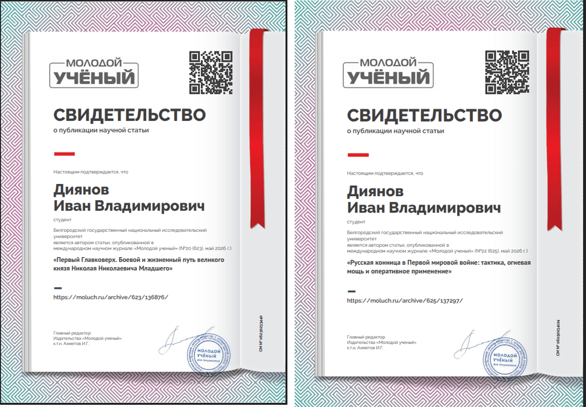

🎓  Русская кавалерия в Первой мировой войне 

(на материалах источников личного происхождения)

Выпускная квалификационная работа

Направление подготовки: 46.04.01 История

**Форма обучения:** Очная, группа 02032409

**Автор:** Дианов Иван Владимирович  
**Научный руководитель:** к.и.н., доцент Истомина И.В.

---

## 📚 Оглавление

1. Введение
2. Глава 1. Русская кавалерия накануне и в начальный период Первой мировой войны (1914 – 1915 гг.)
    - 1.1. Состояние русской кавалерии накануне Первой Мировой войны
    - 1.2. Структура русской кавалерии и состояние её личного состава
    - 1.3. Конский состав русской кавалерии: состояние и проблемы обеспечения
    - 1.4. Специфика боевого применения и тактика русской кавалерии
3. Глава 2. Примеры боевого применения русской кавалерии
    - 2.1. Русская кавалерия в Восточно-Прусской операции
    - 2.2. Роль кавалерии в Виленско-Свенцянской операции
    - 2.3. Проблемы оперативного использования русской конницы
4. Заключение
5. Библиографический список

---

## 🎯 Актуальность
исследования обусловлена, с одной стороны, неослабевающим интересом к истории Первой мировой войны, а с другой — неравномерностью её изучения. Существующая историография в основном оперирует официальными документами и работами Генерального штаба, тогда как взгляд «снизу» или «изнутри» — через дневники, письма и мемуары рядовых участников — остаётся фрагментарным. Между тем именно источники личного происхождения позволяют понять, как кавалеристы осмысливали утрату привычных форм боя, адаптировались к позиционному тупику и меняли свою профессиональную идентичность.

---

## 🧐 Объект исследования

- **Объект:** Русская кавалерия периода Первой мировой войны.
- **Предмет:** Её состояние, тактика и боевое применение, реконструируемые на основе источников личного происхождения.
 
  

## 🎯 Цель работы
на основе комплекса мемуарных и эпистолярных источников дать целостную картину истории русской кавалерии в 1914–1917 гг.  

## Для достижения цели решены следующие задачи:
- охарактеризовано состояние кавалерии накануне и в начальный период войны;
- проанализирована структура, личный и конский состав;
- выявлена специфика тактики и боевого применения;
- рассмотрены конкретные операции: Восточно-Прусская, Виленско-Свенцянская и Брусиловский прорыв.

---

## 🛠  Методологическая основа

базируется на принципах историзма и объективности. Использованы общенаучные методы (анализ, синтез) и специально-исторические: историко-генетический, историко-сравнительный, проблемно-хронологический и метод системного анализа.
 
## 🌟 Научная новизна
работы заключается в том, что она представляет собой попытку обобщить разрозненные свидетельства личного происхождения и на их основе дать сбалансированную оценку действий русской кавалерии, выявив разрыв между романтическими представлениями о конном бое и суровой реальностью позиционной войны.

## 🎓 Практическая значимость
материалы могут быть использованы при подготовке лекционных курсов по истории Первой мировой войны, в военно-исторических исследованиях, а также для создания просветительского контента.

---

## 🔎 Степень изученности
темы можно оценить как среднюю: при хорошей разработанности вопросов структуры и боевого применения кавалерии её социальная и антропологическая история, основанная на личных источниках, остаётся недостаточно исследованной.

## 📜 Источниковая база 
настоящего исследования сформирована на основе широкого круга мемуарной литературы, официальных документов, материалов периодической печати и научных трудов. Условно весь комплекс использованных материалов может быть разделен на две крупные группы: источники личного происхождения (мемуары, воспоминания, дневники участников событий) и историографические работы (труды военных историков и теоретиков как дореволюционного и эмигрантского периодов, так и советского времени).

---

## 🚀 Аппробация

Аппробация результатов отражена в двух публикациях в журнале «Молодой ученый»:

1. «Первый Главковерх. Боевой и жизненный путь великого князя Николая Николаевича Младшего»
2. «Русская конница в Первой мировой войне. Тактика...»

---

## 🔑  Ключевые выводы

| О состоянии кавалерии накануне войны | О структуре и кадрах | О конском составе | О тактике и оперативном применении | Общий итог |
|---|---|---|---|---|
| Россия обладала самой многочисленной конницей в Европе, но её подготовка носила архаичный характер. Господствовала концепция «шока» – атаки в конном строю с холодным оружием, тогда как огневой бой и спешивание считались второстепенными. Великий князь Николай Николаевич, возглавлявший кавалерию с 1895 года, сумел поднять её выучку и смелость, но не смог преодолеть консерватизм генералитета. Как следствие, русская кавалерия оказалась наименее подготовленной к реалиям современной войны| К 1914 году русская кавалерия насчитывала 24 дивизии, 8 бригад и около 140 тысяч сабель. Высокое качество офицерского корпуса (потомственные дворяне, традиция полковой службы) сочеталось с негибкой организацией (четырёхполковые дивизии против трёхбригадных у немцев) и катастрофической нехваткой войсковой конницы в пехотных корпусах. Казачество составляло более 2/3 конницы, но его потенциал в позиционной войне оказался ограничен| При общем поголовье в 35 млн лошадей армия столкнулась с острым дефицитом строевых лошадей уже к 1915 году. Причина – законодательство, освобождавшее от мобилизации единственную лошадь в хозяйстве, и порочная практика сокрытия реального числа лошадей в полках, что вело к падежу от бескормицы. К 1917 году конский состав стал не преимуществом, а бременем для логистики| В маневренный период (1914 – начало 1915) русская кавалерия действовала успешно: разведка, прикрытие, конные атаки. Бой у Ярославице стал вершиной её успеха. Однако уже в 1915 году, в условиях Великого отступления, конница чаще использовалась как «ездящая пехота» для арьергардных боёв. Свенцянский прорыв (август–сентябрь 1915) показал, что крупные конные массы могут эффективно действовать в оперативной глубине, но лишь при условии тесного взаимодействия с пехотой и сохранения высокого темпа. Немецкая конница, насыщенная пулемётами и самокатчиками, действовала методичнее, но теряла скорость; русская, напротив, порывисто атаковала в конном строю, неся потери. Кампания 1916 года и Брусиловский прорыв выявили главную трагедию: имея 60 тысяч сабель на Юго-Западном фронте, русское командование не сумело ввести их в прорыв для развития тактического успеха в оперативный. Конница была либо брошена на неподавленные укрепления (4-й кавалерийский корпус под Ковелем), либо простаивала в тылу из-за нерешительности командармов| Русская кавалерия не смогла реализовать свой предвоенный потенциал не из-за «отмирания» рода войск, а вследствие комплекса факторов: устаревшей тактической доктрины, косности высшего командования, отсутствия подготовленных штабов кавалерийских корпусов и неспособности наладить взаимодействие с пехотой и артиллерией. Тем не менее, высокий боевой дух, кадровый состав и традиции позволили ей избежать полной деградации вплоть до 1917 года. Опыт Первой мировой стал основой для советской кавалерийской школы в Гражданскую и Великую Отечественную войны. |

---

    
🙏 Спасибо за внимание!

